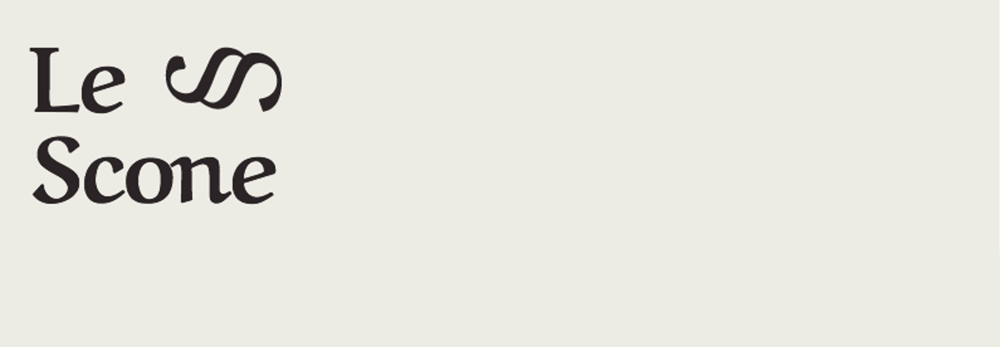

  

  

  
  
  
    
   
   
  

  
  
  
  
 

<h1 align="center">
    
</h1>

<h4 align="center"> 
	🚧 Projeto Le Scone🚧
</h4>

 <a href="#-sobre-o-projeto">Sobre</a> •
 <a href="#-layout">Layout</a> • 
 <a href="#-tecnologias">Tecnologias</a> • 
 <a href="#user-content--licença">Licença</a>

## 💻 Sobre o projeto

🍔 Le Scone ☕ - É um site modelo simples para informações de de uma lanchonete.Este projeto foi desenvolvido usando boas práticas do framework Sass.

Este projeto foi desenvolvido durante o curso **CSS com Sass** oferecido pela [Origamid](https://blog.rocketseat.com.br/primeira-next-level-week/).

Projeto desenvolvido durante a **NLW - Next Level Week** oferecida pela [Rocketseat](https://blog.rocketseat.com.br/primeira-next-level-week/).
O NLW é uma experiência online com muito conteúdo prático, desafios e hacks onde o conteúdo fica disponível durante uma semana.

---

## 🎨 Layout

O layout da aplicação está disponível no Figma:

### Mobile

  

  

### Web

  

  

---

## 🛠 Tecnologias

As seguintes ferramentas foram usadas na construção do projeto:

#### **Website**  ([React](https://reactjs.org/)  +  [TypeScript](https://www.typescriptlang.org/))

-   **[React Router Dom](https://github.com/ReactTraining/react-router/tree/master/packages/react-router-dom)**
-   **[React Icons](https://react-icons.github.io/react-icons/)**
-   **[Axios](https://github.com/axios/axios)**
-   **[Leaflet](https://react-leaflet.js.org/en/)**
-   **[React Leaflet](https://react-leaflet.js.org/)**
-   **[React Dropzone](https://github.com/react-dropzone/react-dropzone)**

> Veja o arquivo  [package.json](https://github.com/tgmarinho/README-ecoleta/blob/master/web/package.json)

#### **Server**  ([NodeJS](https://nodejs.org/en/)  +  [TypeScript](https://www.typescriptlang.org/))

-   **[Express](https://expressjs.com/)**
-   **[CORS](https://expressjs.com/en/resources/middleware/cors.html)**
-   **[KnexJS](http://knexjs.org/)**
-   **[SQLite](https://github.com/mapbox/node-sqlite3)**
-   **[ts-node](https://github.com/TypeStrong/ts-node)**
-   **[dotENV](https://github.com/motdotla/dotenv)**
-   **[Multer](https://github.com/expressjs/multer)**
-   **[Celebrate](https://github.com/arb/celebrate)**
-   **[Joi](https://github.com/hapijs/joi)**

> Veja o arquivo  [package.json](https://github.com/tgmarinho/README-ecoleta/blob/master/server/package.json)

#### **Mobile**  ([React Native](http://www.reactnative.com/)  +  [TypeScript](https://www.typescriptlang.org/))

-   **[Expo](https://expo.io/)**
-   **[Expo Google Fonts](https://github.com/expo/google-fonts)**
-   **[React Navigation](https://reactnavigation.org/)**
-   **[React Native Maps](https://github.com/react-native-community/react-native-maps)**
-   **[Expo Constants](https://docs.expo.io/versions/latest/sdk/constants/)**
-   **[React Native SVG](https://github.com/react-native-community/react-native-svg)**
-   **[Axios](https://github.com/axios/axios)**
-   **[Expo Location](https://docs.expo.io/versions/latest/sdk/location/)**
-   **[Expo Mail Composer](https://docs.expo.io/versions/latest/sdk/mail-composer/)**

> Veja o arquivo  [package.json](https://github.com/tgmarinho/README-ecoleta/blob/master/mobile/package.json)

#### **Utilitários**

-   Protótipo:  **[Figma](https://www.figma.com/)**  →  **[Protótipo (Ecoleta)](https://www.figma.com/file/1SxgOMojOB2zYT0Mdk28lB/Ecoleta)**
-   API:  **[IBGE API](https://servicodados.ibge.gov.br/api/docs/localidades?versao=1)**  →  **[API de UFs](https://servicodados.ibge.gov.br/api/docs/localidades?versao=1#api-UFs-estadosGet)**,  **[API de Municípios](https://servicodados.ibge.gov.br/api/docs/localidades?versao=1#api-Municipios-estadosUFMunicipiosGet)**
-   Maps:  **[Leaflet](https://react-leaflet.js.org/en/)**
-   Editor:  **[Visual Studio Code](https://code.visualstudio.com/)**  → Extensions:  **[SQLite](https://marketplace.visualstudio.com/items?itemName=alexcvzz.vscode-sqlite)**
-   Markdown:  **[StackEdit](https://stackedit.io/)**,  **[Markdown Emoji](https://gist.github.com/rxaviers/7360908)**
-   Commit Conventional:  **[Commitlint](https://github.com/conventional-changelog/commitlint)**
-   Teste de API:  **[Insomnia](https://insomnia.rest/)**
-   Ícones:  **[Feather Icons](https://feathericons.com/)**,  **[Font Awesome](https://fontawesome.com/)**
-   Fontes:  **[Ubuntu](https://fonts.google.com/specimen/Ubuntu)**,  **[Roboto](https://fonts.google.com/specimen/Roboto)**

---

## 👨‍💻 Contribuidores

<table>
  <tr>
    <td align="center"><a href="https://rocketseat.com.br"> <b>Diego Fernandes</b></a> <a href="https://rocketseat.com.br/" title="Rocketseat">👨‍🚀</a></td>
  </tr>
</table>
